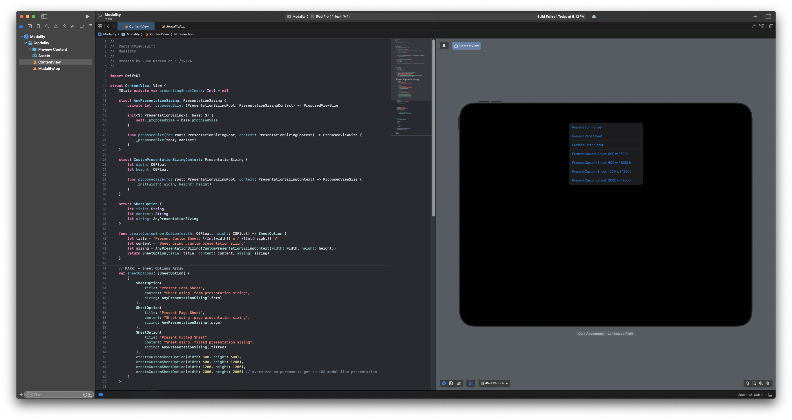
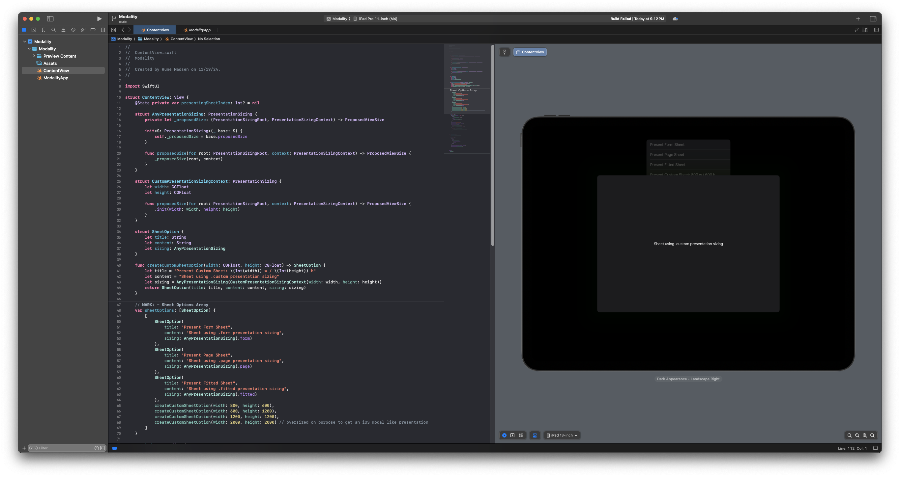

# Modality Playground App

This playground app, Modality, demonstrates various modal presentation styles and configurations on iOS 18 using SwiftUI. It provides a set of options for presenting modals with different presentation sizing strategies, showcasing classic and custom sheet sizes.

## Features

* Classic modal styles:
    * `.form`: Presents a form-style sheet.
    * `.page`: Presents a page-style sheet.
	* `.fitted`: Presents a sheet that adapts to the content size.
* Custom modal sizing, new in iOS 18:
    * Custom modal dimensions (800x600, 1200x1200 and oversized sheet 2000x2000).

## Usage

1.	Clone the repository.
2.	Run the app in a simulator, a device running iOS 18 or as in Xcode preview.
3.	Explore options.

## Requirements

* Xcode 16 or later
* iOS 18 or later

## Screenshots

